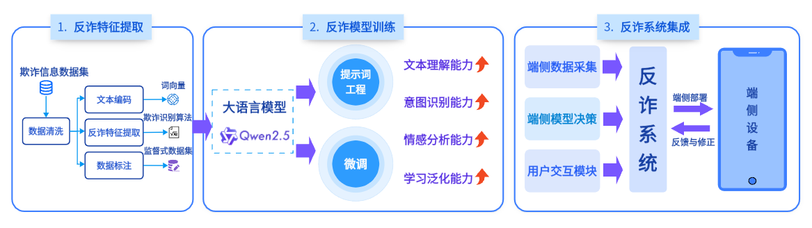
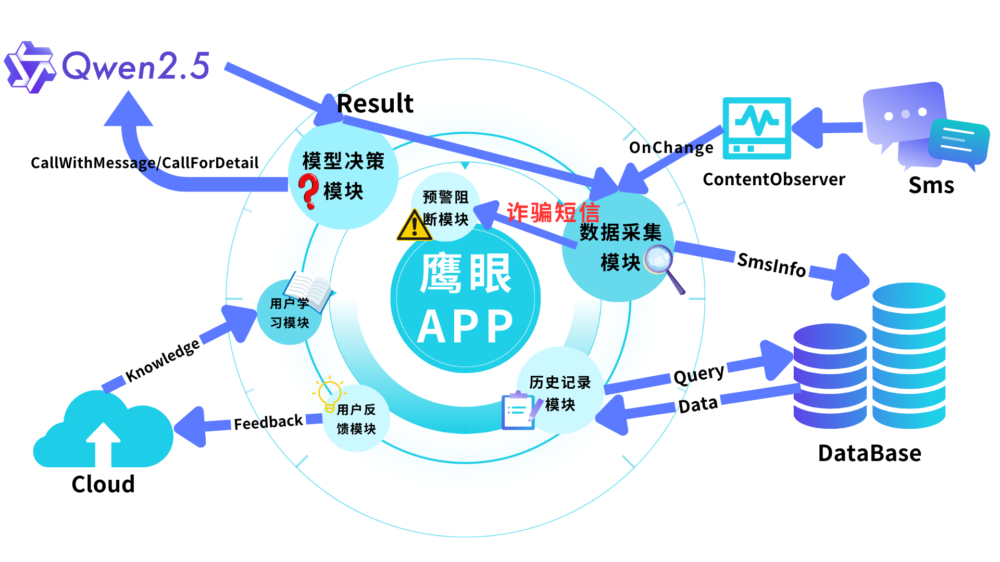
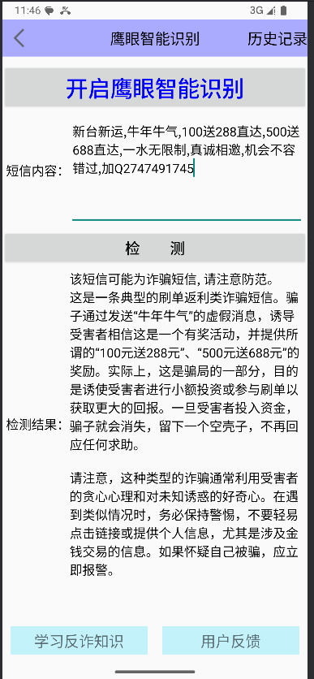
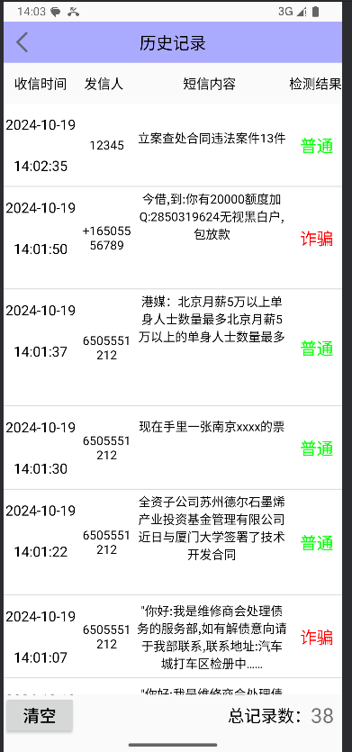
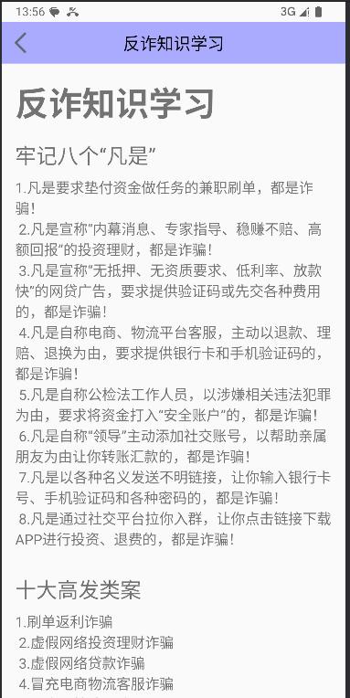

# 鹰眼APP：一个基于手机端侧大模型的智能反诈系统

## APP简介
此APP是本人在参与**FDUROP**科研项目中的产物，名为“**鹰眼**”（**EagleSight**），这是一个基于**Qwen2.5-0.5b**大语言模型的智能反诈系统，旨在通过端侧部署实现对手机短信中诈骗信息的实时识别与预警。该系统利用**LoRA**技术进行[模型微调](https://github.com/TangerineStarrySky/FDU-EagleSight-AntiFraud/tree/FineTune)（微调后模型暂未完成部署），并采用**Q4F16**量化技术优化模型性能，最后利用MLC-LLM工具转换模型格式并部署到终端设备，确保在移动设备上高效运行，同时保护用户隐私。

#### 项目背景
在数字化时代，电信网络诈骗对移动用户构成严重威胁。国家反诈中心数据显示，截至2022年底，公安部门破获电信诈骗案件115.6万起，抓获嫌疑人155.3万名，冻结资金9165亿余元。这凸显了诈骗的严峻态势和对人身及财产安全的巨大威胁。在信息安全问题日益严峻的情形下，传统反诈手段已力不从心，而大语言模型的出现为反诈治理提供了新思路。本课题提出一种基于端侧大模型的智能反诈系统，**利用大模型技术智能识别手机短信和对话中的诈骗信息**，实现事前预警与主动阻断，降低用户欺诈风险。该系统采用**端侧部署**，确保用户隐私数据保留在本地设备，不上传云端，兼具**隐私保护和离线可用**的优势。我们致力于通过技术创新，为用户提供**更智能、更实时、更安全**的反诈解决方案，提升用户对个人数据隐私保护的信心，营造更安全可靠的数字环境。

#### 项目框架图

#### APP框架图

  
 

#### APP功能特点
- **实时监测**：实时分析手机短信内容，快速识别潜在的诈骗信息。
- **动态预警**：一旦检测到诈骗短信，立即向用户发出预警通知。
- **高隐私保护**：所有数据处理均在本地设备完成，不上传云端，确保用户隐私安全。
- **用户交互**：提供用户友好的界面，支持手动检测和自动检测模式，用户可随时查看检测历史和反诈知识。

#### 技术架构
- **模型选择**：Qwen2.5-0.5b大语言模型，经过LoRA微调和Q4F16量化优化。
- **端侧部署**：使用MLC-LLM工具将模型部署到移动设备，确保低延迟和高效率。
- **APP开发**：基于Android Studio开发，支持主流Android设备。

#### 使用方法
1. **安装APP**：使用Android Studio编译APK文件并安装到您的Android设备上。
2. **授权权限**：确保APP已获得短信读取权限。
3. **开启自动检测**：在APP设置中开启自动检测功能，APP将实时监测新短信。
4. **手动检测**：用户也可手动输入或粘贴短信内容进行检测。
5. **查看结果**：检测结果将实时显示在APP界面中，用户可查看预警信息和历史记录。

#### 开发环境
- **开发工具**：Android Studio。
- **编程语言**：Java/Kotlin。
- **模型工具**：MLC-LLM框架。

#### 项目截图

  
  
  
  

### 参考
[MLC-LLM官方文档](https://llm.mlc.ai/docs/deploy/android.html#deploy-android)